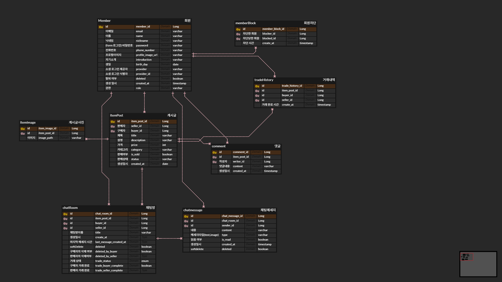
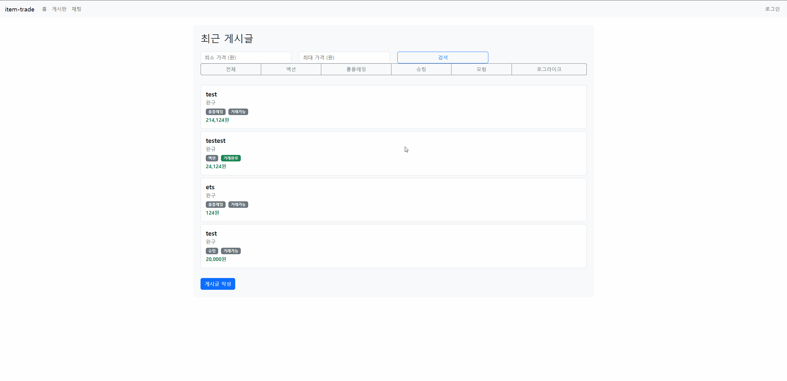
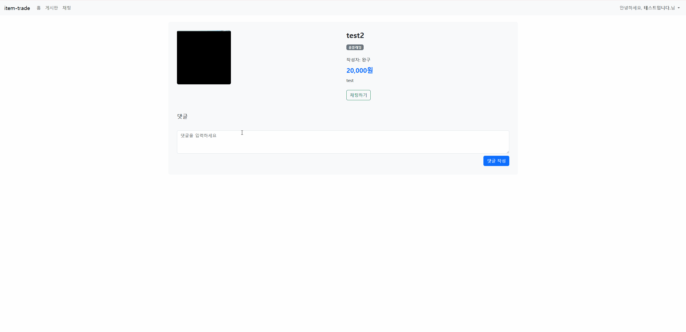
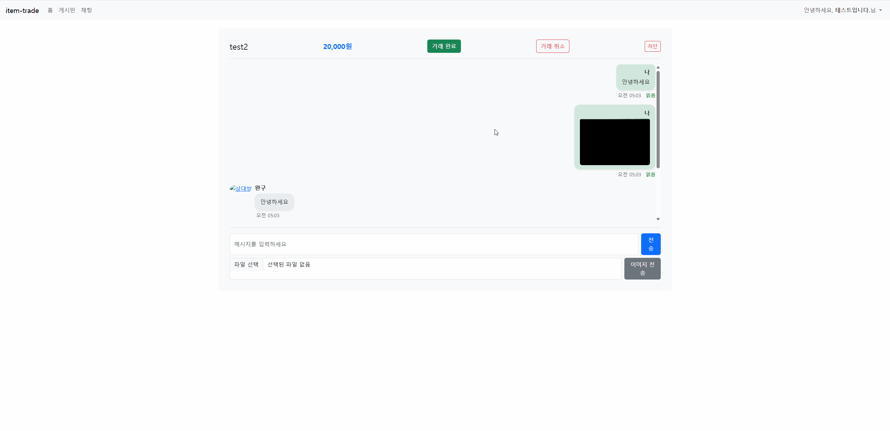
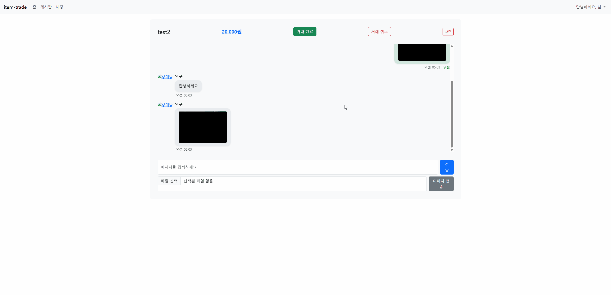
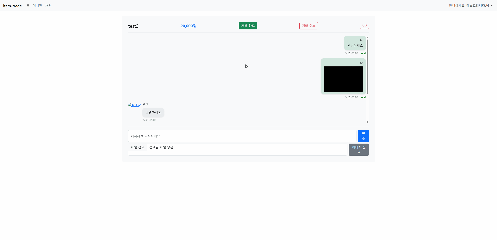

# item-trade

게임 아이템 거래 플랫폼입니다.
사용자는 게시글을 통해 게임 아이템을 거래할 수 있고, WebSocket 기반 실시간 채팅이 가능합니다.

---

## 프로젝트 개요

**item-trade**는 게임 아이템을 사고팔 수 있는 웹 애플리케이션입니다.
소셜 로그인(OAuth2)을 통해 간편하게 로그인하고, 실시간 채팅으로 사용자 간 원활한 커뮤니케이션과 안전한 거래를 지원합니다.

---

## 기술 스택

| 분류         | 기술 구성                                   |
| ---------- | --------------------------------------- |
| Language   | Java 17                                 |
| Backend    | Spring Boot 3.4.4, Spring Security, JPA |
| Frontend   | Thymeleaf, Bootstrap 5                  |
| Database   | MySQL                                   |
| Real-time  | WebSocket (SockJS + STOMP)              |
| Auth       | OAuth2 (Google, Kakao)                  |
| Build Tool | Gradle                                  |

---

## 주요 기능

### 사용자 기능

* 소셜 로그인 (Google, Kakao)
* 회원 정보 수정 및 탈퇴 (Soft Delete 적용)
* 마이페이지: 내가 쓴 글, 참여한 채팅 목록 조회
* 사용자 차단 기능

### 게시글 기능

* 아이템 게시글 등록/수정/삭제 (CRUD)
* 이미지 다중 업로드 (MultipartFile 처리)
* 거래 완료 상태 처리 (판매자/구매자 모두 확인 시 상태 변경)
* 게시글 찜하기
* 게시글 정렬 및 검색 기능 (제목, 가격순 등)

### 채팅 기능

* WebSocket 기반 실시간 채팅
* 1:1 채팅방 생성 및 관리 (구매자-판매자 매칭)
* 메시지 전송/수신, 읽음 처리, 이미지 메시지 지원
* 채팅방 Soft Delete (개별 유저 기준 삭제)
* 안 읽은 메시지 수 표시
* 상대방 프로필 보기
* 채팅 신고 기능 (구현중)

### 마이페이지 기능

* 내가 작성한 게시글 목록
* 찜한 게시글 목록
* 참여 중인 채팅방 목록 정렬 (최신순)
* 최근 메시지 미리보기
* 내 거래 내역 확인 (구현중)

### 공통 기능

* 예외 처리 및 오류 메시지 출력
* 페이징 처리 (게시글, 댓글, 채팅방)
* Ajax 기반 동적 화면 렌더링

---

## 시스템 아키텍처 (요약)

```
[사용자] ── HTTP ─▶ [Spring Controller] ─▶ [Service Layer] ─▶ [JPA Repository] ─▶ [DB]
          └─ WebSocket ─▶ [@MessageMapping] ─▶ [채팅 처리 Service] ─▶ [채팅 메시지 저장]

OAuth2 로그인 흐름: 사용자 → 소셜 인증 → Spring Security → CustomOAuth2UserService → 사용자 식별 및 등록/조회
```

---

## ERD 요약

* **Member**: 이메일, 닉네임, 프로바이더, 상태(탈퇴 여부), 차단 목록 등
* **ItemPost**: 제목, 내용, 가격, 카테고리, 상태(판매중/거래완료), 이미지 URL, 판매자/구매자, 생성 시각 등
* **ItemImage**: 이미지 경로(imagePath), 게시글 연관(item_post_id)
* **Comment**: 댓글 내용(content), 작성자(writer_id), 게시글(item_post_id), 생성 시각(created_at)
* **ChatRoom**: 제목, 생성일시, 마지막 메시지 시간, 거래 상태, 삭제 여부, 구매자/판매자, 게시글 연관
* **ChatMessage**: 채팅방(chat_room_id), 보낸 사람(sender_id), 메시지 내용(content), 메시지 타입(TEXT / IMAGE), 읽음 여부(is_read), 생성 시각(created_at)
* **MemberBlock**: 차단한 회원(blocker), 차단당한 회원(blocked), 차단 시각
* **TradeHistory**: 거래자(구매자/판매자), 관련 게시글, 거래 완료 시각

> ERD 시각화는 `/docs/ERD.png` 참고
 


## 테스트 및 보완 예정 항목

### 테스트 항목

* 단위 테스트

    * 회원 서비스 (회원 등록, 수정, 탈퇴, 차단)
    * 게시글 서비스 (등록, 수정, 삭제, 거래 완료 처리)
    * 채팅 서비스 (메시지 전송, 읽음 처리, 채팅방 삭제)
* 통합 테스트

    * OAuth2 로그인 → 회원 등록 → 게시글 등록 → 채팅 시작 시나리오
    * 채팅방 생성 → 메시지 전송 → 읽음 여부 확인 → 채팅방 삭제 시나리오
* Security 테스트

    * OAuth2 로그인 후 인증 세션 유지 검증
    * Form 로그인 및 접근 제어 테스트
* 테스트 코드 CI 통합 (GitHub Actions 적용)

    * 테스트 커버리지 확인 및 CI 통과 여부 검증

### 보완 및 리팩토링 예정 기능

* 게시글 검색 기능 개선 (게임명, 닉네임 등 복합 검색)
* 채팅 신고 기능 (신고 데이터 저장 및 관리자 처리 시나리오)
* 사용자 알림 기능 (신고 알림, 거래 완료 알림 등)
* 전체 API Swagger 문서화 (SpringDoc or Swagger-UI)

---

## 개선 점

* OAuth2 인증 처리 시 provider + providerId 기준 사용자 식별 방식 설계
* WebSocket 인증 문제 해결: 인증 정보 세션 유지 처리
* 채팅 Soft Delete: 구매자/판매자별 각각 삭제 상태 관리
* 게시글 이미지 다중 업로드 → MultipartFile 유효성 검사 및 파일 시스템 저장 구현
* Ajax를 이용한 댓글/채팅 페이징 처리
* 채팅 메시지 구분 (텍스트/이미지) 및 렌더링 분기

---

## 배운 점

* 실시간 통신(WebSocket)과 인증(OAuth2)을 직접 구현하면서 인증 흐름과 세션 관리를 명확히 이해함
* 게시글/채팅 기능을 통해 도메인 중심의 설계(DDD-lite)를 학습함
* 예외 처리, 유효성 검증, 사용자 중심의 기능 설계 경험을 쌓음
* 페이징, 이미지 업로드, 소셜 로그인 등 실무에서 자주 쓰이는 기술 흐름을 체득함

---

## 핵심 로직 시연 영상

#### 1. 소셜 로그인 → 게시글 등록 (이미지 첨부 포함)
> `/docs/login-post.gif` 참고
 

#### 2. 게시글 클릭 → 채팅방 생성 → 메시지 전송 및 읽음 확인
> `/docs/chat-flow.gif` 참고 
 

#### 3. 거래 완료
> `/docs/complete.gif` 참고


#### 4. 거래 취소 -> 재거래
> `/docs/cancel-retrade.gif` 참고


#### 5. 마이페이지 조회 + 사용자 차단 → 차단 시 채팅 불가
> `/docs/mypage-block.gif` 참고
 


---
## 🟢 배포 URL
- [https://item-trade.co.kr](https://item-trade.co.kr)

## CI/CD 자동 배포
- **GitHub Actions**를 사용한 EC2 자동 배포 파이프라인 구축
- main 브랜치에 merge 시 자동 빌드 및 배포 진행
- **배포 자동화로 실시간 피드백 및 신속한 서비스 개선 가능**

## 테스트 계정 (즉시 체험)
- **이메일:** test@item.com
- **비밀번호:** test1234
> 위 계정으로 로그인하면, 아래 모든 기능을 직접 체험할 수 있습니다!

## 주요 체험 가능 기능
- **OAuth2 소셜 로그인 (카카오/구글)**
- **실시간 1:1 채팅 (WebSocket)**
- **아이템 거래 요청/수락**      
- **찜하기, 게시글 등록/수정/관리 등 거래 플랫폼 주요 기능**

